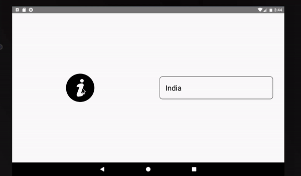

# React Native ToolTip



**react-native-tooltip** is a light weight library that provides functionality to add a tooltip for any element. A tooltip is used to specify extra information about something when the user clicks over an element. By default, the tooltip will be displayed below the element. But it can be configured using the direction passed to the component. This is an independent package.

The package exports Overlay and ToolTip components.

Overlay component covers the entire viewport and shows the tooltip content over it, by calculating the position based on the direction.

Tooltip takes the content and direction parameters to display the corresponding content on clicking over the element. The content is displayed based on the different directions passed to the component: top, right, bottom, left.


# Setup
### Installation

`$ npm install react-native-tooltip-mroads --save`

or

`$ yarn add react-native-tooltip-mroads`


### Props

Tooltip takes the below props for implementation.

| Prop           |     Default     |   Mandatory   |   Type   | Description                                                                                                 |
| :------------- | :-------------: | :------: | :------: | :---------------------------------------------------------------------------------------------------------- |
|content     |  <View />  |  Yes  |  `React Node`  | Children or content to be shown |
| direction     |  bottom  | No  |  `String`  | Direction where tooltip data is to be displayed|

#### Directions Supported
| right         |     bottom    |                                                                                             
| :------------- | :-------------: |

### Example
```javascript

import React from 'react';
import {View, Text, StyleSheet, FlatList, TouchableOpacity, Image} from 'react-native';
import {Overlay, Tooltip} from 'react-native-tooltip-mroads';
import infoImage from './assets/information.png';

const styles = StyleSheet.create({
  outerContainer: {
    flexDirection: 'row',
    width: '100%',
    height: '100%',
  },
  container: {
    width: '50%',
    height: '100%',
    alignItems: 'center',
    justifyContent: 'center',
  },
  container2: {
    width: '50%',
    height: '100%',
    alignItems: 'center',
    justifyContent: 'center',
  },
  toolTipContainer: {
    color: 'blue',
    padding: 20,
    justifyContent: 'center',
    alignItems: 'center',
    width:400,
    height:200
  },
  textInputContainer: {
    borderWidth: 1,
    borderColor: 'black',
    borderRadius: 10,
    width: 400,
    height: 80,
    padding: 20,
    justifyContent: 'center',
  },
  textInput: {
    textAlign: 'left',
    fontSize: 26,
  },
  iconContainer: {
    color: '#FFFFFF',
    fontSize: 24,
    padding: 30,
    justifyContent: 'center',
    alignItems: 'center'
  },
  iconText: {
    width: 150,
    height:200,
    backgroundColor: 'black'
  },
  imageStyle: {
    width: 100,
    height: 100,
    justifyContent: 'center',
    alignItems: 'center',
  },
});

class MainApp extends React.Component {
  state = {
    selectedCountry: 'India',
  };

  setSelectedCountry = country => {
    this.setState({selectedCountry: country});
  };

  renderCountry = ({item}) => (
    <TouchableOpacity
      style={{width: 350, height: 70, backgroundColor: 'black'}}
      onPress={() => this.setSelectedCountry(item)}>
      <Text style={{color: '#FFFFFF', fontSize: 26, padding: 20}}>{item}</Text>
    </TouchableOpacity>
  );

  renderCountryTooltip = () => {
    const countryList = [
      'United States',
      'United Kingdom',
      'United Arab Emirates',
    ];

    return (
      <View style={styles.toolTipContainer}>
        <FlatList
          data={countryList}
          renderItem={this.renderCountry}
          keyExtractor={item => item}
        />
      </View>
    );
  };

  renderIconTooltip = () => {
    return (
        <View style={styles.iconText}>
            <Text style={styles.iconContainer}>Find the relevant information here</Text>
        </View>
    )
  };

  render() {
    const {selectedCountry} = this.state;
    return (
        <View style={styles.outerContainer}>
            <Overlay />
            <View style={styles.container2}>
                <Tooltip content={this.renderIconTooltip()} direction="right">
                    <View>
                        <Image source={infoImage} style={styles.imageStyle} resizeMode="contain" />
                    </View>
                </Tooltip>
            </View>
            <View style={styles.container}>
                <Tooltip content={this.renderCountryTooltip()}>
                    <View style={styles.textInputContainer}>
                        <Text style={styles.textInput}>{selectedCountry}</Text>
                    </View>
                </Tooltip>
            </View>
      </View>
    );
  }
}

export default MainApp;


```

The above example illustrates the usage of Tooltips. The view to be rendered by default is passed as children to Tooltip component. On clicking the icon or text input, an overlay is created which shows the tool tip (content passed to the Tooltip component) either on the right or bottom of the of the element (based on the direction passed to the Tooltip component).